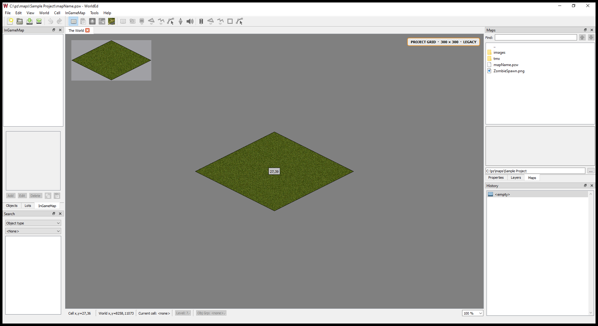

# PZTools Unofficial

An unofficial, maintained Qt 5 edition of the Project Zomboid mapping tools:
**WorldEd**, **TileZed**, and **BuildingEd**.

This repository continues the work in Tim Baker's
[pzworlded](https://github.com/timbaker/pzworlded) and
[tiled](https://github.com/timbaker/tiled) repositories. It starts from the
upstream `basements` work, preserves basement and negative-level support, and
adds a portable Windows distribution, native 256-cell workflows, image editing,
mapping automation, stability fixes, and current Project Zomboid data support.

This is a community project. It is not an official The Indie Stone release.
Project Zomboid game assets are not included.

Current release documentation: [August 4, 2026 changes](RELEASE_CHANGELOG.md),
[feature reference](docs/Feature-Reference.md), and
[logs/diagnostics](docs/Diagnostics-and-Logs.md).



## Why do unofficial mapping tools exist?

The source code of the Project Zomboid mapping tools has remained publicly
available and has continued to receive updates. Source availability, however,
is not the same thing as a usable release. Matching official binaries,
configuration files, and Tiles packages have repeatedly arrived late, remained
available only through scattered forum links, or not been released at all. At
the time this project was created, the Steam tools were older than the version
distributed through Project Zomboid's own forum.

Over the years it also became increasingly apparent that the original tools
were no longer being developed from the day-to-day perspective of an active
mapper. They continued to gain the minimum support required for new game data,
but comparatively little work addressed the long-standing workflow, usability,
performance, distribution, and reliability problems encountered when creating
and maintaining real maps.

The original decision to publish the source was nevertheless extremely
valuable. It gave the mapping community an early view of future formats and
made it possible to prepare for changes such as 256 × 256 cells, Biomemap,
depth maps, basements, and other Build 42 systems before public game releases
made them unavoidable. In several cases, community tool maintainers understood
an upcoming format before working TIS mappers had been briefed about it. That
suggests that, at least historically, tool and format development sometimes
progressed in parallel with the mapping team rather than through one
fully synchronized production pipeline.

The releases did not keep pace with those source changes. Without community
builds and fixes, there would have been no practical public B42 mapping
workflow when mappers needed one. Those builds did more than keep existing
projects opening: they made B42 maps possible, trained dozens of new mappers,
documented new concepts, and helped some creators build the visible body of
work that later led to paid mapping jobs.

The missing pieces were not limited to executables. Required configuration
files and current Tiles were also frequently absent from official
distributions. Even now, the community is still waiting for an official,
complete release of Tiles introduced around the Build 41.78 Louisville
changes, together with an unambiguous statement that those resources may be
used in the public mapping workflow.

You can, of course, wait for an official release. It is also worth noticing
that newer mapping utilities such as the depth-map and street-name editors
appeared directly inside the game. Whatever the internal reasons, that is a
strong sign that the in-game Java toolchain became the practical place to
deliver tools when the separate C++ editors could not evolve quickly enough.
It does not make WorldEd, TileZed, or BuildingEd obsolete; it demonstrates the
maintenance gap that unofficial releases have been filling.

I still hope that the official tools will catch up with the unofficial ones,
adopt any ideas that prove useful, and eventually remove the need for this
project. I also know that this work is visible to TIS, although I do not expect
an official endorsement of a community fork. More importantly, I cannot
promise to carry it forever: TIS is a profitable studio, while I develop,
test, document, support, and distribute these tools in my free time.

If you believe you can do better, please do it. Open source becomes healthier
when more people are willing to maintain it. So far, however, repeated official
and community announcements have not produced another complete, current,
publicly usable tool suite. Before dismissing unofficial tools, remember the
gap they filled, the maps they enabled during the last two years, the people
they helped into professional work, and the dozens of mappers they helped
teach.

You're welcome. It was my pleasure.

## The three editors

| Application | Main purpose | Notable additions in this fork |
|---|---|---|
| **WorldEd** | Assemble the world, assign TMX maps to cells, edit roads and zones, and export map data | Per-project 300/256 grids, terrain and vegetation PNG editor, procedural terrain tools, improved thumbnails, Biomemap and Zombie Heatmap tools, safer InGameMap export |
| **TileZed** | Edit TMX maps, tilesets, TileDefs, depth geometry, Automapper rules, and run Lua mapping tools | Build 42 depth-map editor, complete tileset catalog preload, 2x/custom-only support, restored Automapper, expanded Lua API, pack and tileset utilities, clearer tile status and diagnostics |
| **BuildingEd** | Create and edit TBX buildings, rooms, furniture, roofs, grime, and building metadata | Standalone executable, complete Tile/Furniture/Object palettes, category validation, templates, autosave, and transactional Lua building scripts |

## Highlights

### Portable, shared configuration

- No installer, Registry configuration, `%APPDATA%` dependency, or
  standalone `config.exe`.
- The first editor started opens **PZTools Initial Setup** only when no valid
  Tiles directory can be detected.
- WorldEd, TileZed, and BuildingEd share the same paths through
  `settings/PZTools.ini`.
- Packaged catalogs remain in `config`; runtime preferences and logs remain in
  `settings`.
- Selecting `Tiles`, `Tiles/1x`, `Tiles/2x`, or `Tiles/custom` is normalized
  automatically. A `1x` directory is not required.
- Settings are schema-versioned. Incompatible UI state can be reset during an
  upgrade while valid shared paths are preserved.
- Unicode paths and portable side-by-side installations are supported.

### Predictable tileset availability

Every catalog tileset is decoded during application startup and remains
resident for the editing session. This makes the complete catalog immediately
available to palettes, building categories, Automapper, and Lua scripts without
changing behavior depending on which map was opened first.

The trade-off is deliberate: startup can take tens of seconds and several
gigabytes of memory with a current 2x Tiles installation. The progress dialog
and `settings/logs` report the total, loaded, missing, and unresolved entries.
Missing or corrupt images use an explicit placeholder instead of causing a
silent empty palette.

### Editing-path responsiveness

Routine painting no longer starts unrelated catalogue work:

- the minimap renderer reuses the ready shared tileset catalogue instead of
  reloading it after map edits;
- a missing or invalid Automapper manifest is attempted once per document,
  not once per brush stroke;
- the Tile Layers panel rebuilds only while visible and only when the edited
  region contains its inspected square; and
- tileset usage/status icons are refreshed only while their dock is visible
  and are grouped with a short debounce during a stroke.

The minimap still receives map changes through its named background worker,
and visible docks still catch up when shown. The audit intentionally preserves
required document, Undo, renderer, and Lua-tool updates.

### 300 × 300 and 256 × 256 projects

World geometry is stored per project as either:

- **300 × 300 (Legacy)** for the historical mapping workflow; or
- **256 × 256 (Native)** for current native cells.

The selected geometry is used consistently by world and cell views, coordinate
conversion, thumbnails, BMP/TMX conversion, building import, procedural image
tools, LOT generation, InGameMap export, and Lua placement. Existing 300-cell
projects remain supported.

## WorldEd

### Project Doctor for tiles and paths

**Tools > Project Doctor: Tiles and Paths...** gives a saved project a
two-step **Check project / Fix safely** workflow:

- normal results use a four-column table: status, file, plain-language
  meaning, and what the mapper can do next. Clean files are grouped, while the
  complete parser report stays behind **Show support details**;
- the loaded PZW folder is selected automatically and Downloads, OneDrive,
  game-installation, absolute, missing, and outside-project paths are reported
  in plain language;
- the interface explains that TMX maps belong to TileZed and TBX buildings
  belong to BuildingEd instead of assuming knowledge of the file formats;
- TMX object references to TBX files are resolved relative to their map and
  only existing in-project paths are normalized automatically;
- missing used tilesets and missing/external TBX dependencies are preserved
  and shown as work the mapper must resolve;
- stale TMX declarations are removed only when the sheet is both unused and
  unresolved. Valid unused sheets remain in the complete ordered header for
  deterministic legacy compatibility;
- retained inline TMX image paths are normalized to the same readable 2x,
  then 1x/custom PNG selected by the shared tools; and
- TBX cleanup uses BuildingEd's object model to rebuild the ordered
  `tile_entry`, `user_tiles`, and furniture ID tables and remap every
  reference. A second canonical round trip must be byte-stable.

Fixes are atomic and every changed file is first copied below the project in a
dated `.pztools-backups/tileset-cleanup-*` directory. Backup trees are excluded
from subsequent scans. The complete safety policy and recovery procedure are
documented in
[Project Doctor: TMX, TBX, tiles, and paths](docs/PZ-Project-Doctor-Tiles-and-Paths.md).

### Project WorldGen biome and prefab editors

Two independent commands are available after a saved WorldEd map project is
loaded:

- **Tools > WorldGen Biome Editor / Preview...**
- **Tools > WorldGen Prefab Editor...**

The biome window contains biome rules, biome features, and the representative
2x2-chunk preview. The prefab window contains only true static-prefab
inspection, creation, TMX/TBX conversion, painting, and staging. Biome and
prefab controls are never mixed in the same window.

The game WorldGen directory is always identified as a read-only source.
Project-owned Lua is kept separately under:

`<map-project>/media/lua/server/WorldGen`

- The loader reads biome features, static prefabs, procedural biomes, map
  biomes, subbiomes, parent relationships, selection parameters, placements,
  protections, and replacements in an isolated Lua state with no file,
  package, operating-system, or network libraries.
- Game definitions are loaded before project definitions. Biome-feature,
  static-prefab, and biome selectors identify every entry as **Game** or
  **Project**.
- New procedural or map biomes can be created with a parent, generation flag,
  selection parameters, and weighted biome features. A game biome is edited safely
  by creating a project variant that inherits its advanced rules. Project
  biomes created by the editor can be edited in place.
- Biome features use the engine's 1x1 through 8x8 pattern format. Their visual
  editor shows the resolved Tiles sprite in every pattern cell.
- True `worldgen.prefabs` are edited separately as z=0 schematics with the four
  engine slots `Floor`, `FloorFurniture`, `FloorOverlay`, and `Furniture`.
  The editor supports dimensions through 256x256, a Tiles palette, direct
  painting, zombie chance, and a depth-sorted isometric preview with visible
  8x8 chunk lines and full-height XL/XXL sprite footprints.
- Restricted TMX and one-floor TBX sources can be converted to prefabs. The
  converter accepts explicit Project Zomboid z=0 TMX layers and stops on
  upper/lower levels, multiple Floor tiles, or more tile layers per square
  than the four-slot runtime format can preserve; ignored object/building
  metadata is always disclosed before saving.
- **Stage for Game / Mod** writes the prefab and a marked static-module block
  in `media/maps/<MapName>/WorldGenOverride.lua`. Existing unmarked override
  content is preserved. The target must be a project/mod root outside the
  Project Zomboid installation.
- A selected biome is resolved through its parent chain and rendered with the
  configured Tiles catalogue on the game's 16 x 16-square generation unit,
  equivalent to 2 x 2 Build 42 chunks.
- Ground, plant, bush, tree, and ore categories can be hidden independently.
  The definition tree displays feature probabilities and pattern dimensions;
  clicking a preview square identifies its sprites and source features.
- JUMBO, JUMBOXL, and JUMBOXXL sheets use their declared custom tile
  geometry. XL and XXL trees reconstruct the game's main-sprite `N` plus
  treetop `N+6` pair, and the fitted canvas reserves enough space for their
  full height and width. A custom sheet whose pixel dimensions do not match
  its declared geometry is reported as unavailable instead of being
  mis-sliced into floating or clipped trees.

Format distinctions, runtime limits, conversion rules, project paths, and the
staging workflow are documented in
[`WorldGen Preview, Biomes, Features, and Prefabs`](docs/PZ-B42.20-WorldGen-Editor-and-Prefabs.md).
- Procedural and `biomes_map` registries can be inspected separately. Map
  biomes currently use an empty synthetic surface, so placement, protection,
  and replacement behavior that depends on an authored map is reported but
  is not yet reproduced.
- Advanced `subbiomes`, `placements`, `protected`, and `replacements` tables
  are inspected and inherited but are not rewritten by this first editor.
  A project biome containing such hand-authored rules is copied to a child
  variant instead of being overwritten in place.
- The current deterministic preview seed is representative. It is not yet a
  pixel-identical simulation of a Project Zomboid save seed. Roads and erosion
  are intentionally outside this module.

## TileZed and BuildingEd

### Procedural loot viewer and editor

The same Build 42 loot tool is available through **TileZed > Tools >
Procedural Loot Viewer / Editor...** and **BuildingEd > Building > Procedural
Loot Viewer / Editor...**.

- It loads the game's `Distribution_*.lua`, `Distributions.lua`, and
  `ProceduralDistributions.lua` as read-only references.
- RoomDef/container mappings and reusable procedural distributions are shown
  together with their **Game** or **Project** provenance.
- TileZed can open on the selected tile's `container` property. BuildingEd can
  open on the current room's internal RoomDef name.
- Item values are labelled **Chance / roll**. A separate neutral cumulative
  preview is shown without claiming exact in-game probability.
- Procedural `weightChance` values are shown as relative selector weights.
  `min`, `max`, and force-by-item/zone/tile/room constraints remain visible.
- New entries and cloned overrides are written outside the game below
  `<project-or-mod>/media/lua/server/Items` as an editor manifest plus
  generated post-merge Lua.
- The project root is rejected when it points into the selected game
  installation.

The format, probability semantics, workflow, limits, and validation command are
documented in
[`Build 42.20 procedural loot viewer and editor`](docs/PZ-B42.20-Procedural-Loot-Editor.md).

### Terrain and vegetation image editor

WorldEd contains a lightweight image editor for the project `Map.png` and
`Map_veg.png` pair. The command is enabled after a WorldEd project is loaded,
because palette colors, cell dimensions, and output paths belong to that
project.

- Ground and vegetation colors come from `Rules.txt`.
- Unknown colors are reported with their RGB value, pixel coordinate, and
  affected file.
- Images can cover multiple 300 × 300 or 256 × 256 cells.
- Brush, fill, color picker, vegetation eraser, zoom, composite preview,
  undo, and redo are included.
- PNG saves are atomic and checked before the original is replaced.
- The working-memory limit is configurable from **128 MiB to 64 GiB**; the
  default is **512 MiB**.
- Procedural tools can generate terrain patches, vegetation, lakes, rivers,
  and roads continuously across cell boundaries.

### World and export tools

- Safe trimming of empty cells from the outer world rectangle, including
  project-origin and road-coordinate updates.
- Correct thumbnails for both grid formats, selection-only rebuilds, and
  configurable thumbnail resolution and grid appearance.
- Restored and optimized Biomemap generation using both ground and vegetation
  images. Only `Vegitation`, `DeepForest`, `Forest`, `TownZone`, `Farm`,
  `FarmLand`, and `TrailerPark` are written to its green channel; every other
  vector zone/object remains an `objects.lua` export.
- Editable Zombie Heatmap with 300-cell and native 256-cell geometry, brush
  controls, undo, atomic save, and a safety backup.
- Restored InGameMap road generation for roads, trails, and railways.
- XML and binary InGameMap outputs are validated and committed as one
  recoverable pair.
- Complete map-mod export using the current 8 × 8 layout.
- BMP→TMX files are relinked to the shared catalog by tileset name, including
  installations where only the 2x image exists.
- An unclean shutdown no longer creates an automatic project-restore crash
  loop; the following start skips restoration and explains how to recover.

## TileZed

### Tiles, TileDefs, and Automapper

- Import Project Zomboid tilesets directly from PNG.
- Custom tile dimensions up to 4096 pixels and Jumbo tiles in pack tools.
- Added an advanced `.pack` comparator with pack/pixel/metadata SHA-256,
  added/removed/modified/duplicate statuses, filters, sortable results,
  side-by-side tile previews, a color-coded pixel difference view, and CSV
  export.
- Expanded the Pack Viewer extractor with checked texture selection, multiple
  filter modes, per-texture previews and hashes, reconstructed individual
  sprites, automatic/1x/2x/custom tileset sheets, complete atlas-page export,
  safe conflict policies, output grouping, and an optional JSON manifest.
- Opening the Versatile Pack Extractor now displays cancellable page/texture
  progress while thumbnails and hashes are prepared; extraction phases are
  reported too, so large packs no longer look like a frozen application.
- `.pack` version 0 and Build 42 version 1 input is bounds-checked before
  decoding. Truncated PNG data and invalid packed/canvas geometry are rejected
  explicitly.
- See `TileZed/docs/PZ-Pack-Comparator-and-Extractor.md` for the workflow and
  exact hash semantics.
- Invalid binary `.tiles` metadata now identifies the exact failing value
  instead of combining dimensions, ID, and tile count into one generic error.
  The diagnostic shows the tileset entry, stored grid/capacity, ID, record
  count, format limits, file path, and targeted repair guidance. Truncated
  strings, numeric metadata, property counts, and property name/value fields
  are reported separately with their tileset, tile, and property positions.
- The `.tiles` comparator now reports complete file SHA-256, unique tilesets,
  structural ID/image/grid/count changes, modified and one-sided tile records,
  searchable status filters, side-by-side tile previews, highlighted property
  values, explicit File 1/File 2 merge choices, and copy/export reports.
- The Snow / Replacement Editor defaults to `SnowTile`, supports `BurntTile`
  and custom mapping keys, batch assignment and same-ID matching, blue resolved
  previews, red unresolved-reference diagnostics, accurate dirty tracking, and
  save prompts only after real changes.
- See `TileZed/docs/PZ-TileDef-Comparator-and-Snow-Editor.md` for both
  workflows and the comparator's structure-safe merge boundary.
- Tile names, numeric IDs, resolution, and loaded/missing status are visible in
  editor palettes.
- B42 TileDef properties were audited against game sources and supplemented
  with English descriptions and contextual tooltips.
- The restored Automapping panel accepts TMX rule maps and nested TXT rule
  lists, detects recursion and duplicate loading, and supports Object Groups,
  property wildcards, and object add/change/remove triggers.
- Automapper now prefers the unambiguous `automapping-rules.txt` manifest and
  keeps legacy `rules.txt` manifests compatible. WorldEd terrain/BMP
  `Rules.txt` files are recognized and ignored instead of producing one
  missing-file error per terrain-rule line. Missing or invalid manifests are
  attempted once per document, so interactive Automapping cannot stall every
  brush stroke; press Reload after correcting a manifest.

### Build 42 depth geometry

**Tools > Depth Map Editor...** opens a geometry-first editor for the selected
tileset. It reads and writes Build 42 `tileGeometry.txt` primitives together
with the matching `DEPTH_<tileset>.png` atlas.

- Add `XY`, `XZ`, or `YZ` polygons, boxes, and cylinders.
- Select wireframes directly over the source tile, drag them in X/Z, and edit
  exact translations, rotations, bounds, radii, height, and polygon points.
- Rasterize one primitive into existing pixels or rebuild the complete depth
  tile from its geometry, optionally restricted by source-tile opacity.
- Use the separate Pixel Retouch tab for inspection and manual corrections.
- Save geometry and the full eight-column depth atlas together with `Ctrl+S`.

Geometry writes use the current version-2 integer-coordinate format and replace
only the active tileset block, preserving unrelated tilesets and tile-property
blocks already present in `tileGeometry.txt`.

### Lua mapping automation

The portable `lua` directory includes the common mapping scripts and examples.
The current API keeps existing scripts working while adding:

- UTF-8 console output, tracebacks, progress reporting, and cooperative cancel;
- negative levels and WorldEd cell coordinates;
- Object Group and RoomDef access, creation, modification, and removal;
- tile lookup by exact name and layer lookup by `(level, baseName)`;
- exact-position and map-wide tile deletion and replacement;
- whole-layer removal and named placement with automatic tileset attachment;
- Undo integration for map changes; and
- a restricted `app` interface for documented editor actions.

`LuaTools.txt` can be supplied by a separate user catalog. Portable installs
detect when the user and application catalog are the same file and load it only
once.

See the [Lua scripting reference](docs/TileZed/LuaScripting.html) and
the [Automapper guide](docs/TileZed/Automapper.html).

## BuildingEd

- Standalone application with the same portable settings and external QSS
  themes as WorldEd and TileZed.
- Full tileset catalog is loaded before a building, template, or palette is
  displayed.
- Tile mode selects an available tileset by default instead of opening on an
  apparently empty palette.
- Ortho and Iso object modes refresh all 17 tile categories and all Furniture
  groups after `BuildingFurniture.txt` is loaded.
- Stable palettes for Roof Caps, roofs, walls, windows, grime, furniture, and
  every other category.
- Templates, RoomTone, Attribute mode, basements, negative floors, grime,
  unlit-room inspection, autosave, and binary/TMX export are retained.
- Transactional Lua 5.2 scripts provide building inspection, room fill,
  tile placement/removal/replacement, Undo, and restricted save/export actions.
- `BuildingEd.exe --validate-building-categories` validates the complete
  tileset catalog, all 26 templates, Tile mode, 175 Furniture groups, and both
  the Ortho and Iso category panels.

## Installing a compiled release

1. Extract the complete archive to a writable directory.
2. Keep the directory structure intact. Do not move an executable out of
   `bin`.
3. Extract or copy the Project Zomboid mapping Tiles separately. They are not
   redistributed with PZTools.
4. Start `PZWorldEd.exe`, `TileZed.exe`, or `BuildingEd.exe` from `bin`.
5. If **PZTools Initial Setup** appears, select the release `config` directory
   and your extracted Tiles directory.

A typical portable layout is:

```text
PZTools/
├── bin/             applications, Qt libraries, and Qt runtime plugins
├── config/          Rules.txt, Tilesets.txt, TMXConfig.txt, Building*.txt
├── docs/            packaged user documentation
├── lua/             TileZed and BuildingEd scripts
├── plugins/         Tiled format plugins
├── themes/          external QSS themes
├── translations/
├── settings/        created at runtime; shared INI files and logs
└── Tiles/           optional local game Tiles; not included
    ├── 1x/          optional
    ├── 2x/          optional
    └── custom/      optional
```

If the Tiles directory is moved later, use **Change Shared Paths** from WorldEd
or TileZed. BuildingEd consumes the same shared setting.

## Documentation and issue reports

- [Complete documentation index](DOCUMENTATION.md)
- [Offline documentation home](docs/index.html)
- [User-facing feature reference](docs/Feature-Reference.md)
- [Shared configuration files and Build 42.20 catalogue audit](docs/PZTools-Configuration-Files.md)
- [PZTools user guide](docs/TileZed/PZToolsGuide.html)
- [Lua scripting reference](docs/TileZed/LuaScripting.html)
- [Automapper guide](docs/TileZed/Automapper.html)
- [Project Doctor for PZW/TMX/TBX tiles and paths](docs/PZ-Project-Doctor-Tiles-and-Paths.md)
- [WorldGen biome and prefab editor](docs/PZ-B42.20-WorldGen-Editor-and-Prefabs.md)
- [Procedural loot editor](docs/PZ-B42.20-Procedural-Loot-Editor.md)
- [Pack comparator and extractor](docs/PZ-Pack-Comparator-and-Extractor.md)
- [TileDef comparator and Snow/Replacement editor](docs/PZ-TileDef-Comparator-and-Snow-Editor.md)
- [Logs, diagnostics, validators, and issue reports](docs/Diagnostics-and-Logs.md)
- [Upstream history and source provenance](UPSTREAM-HISTORY.md)
- [Detailed fork changelog](CHANGELOG-PZTOOLS.md)
- [Current release changes](RELEASE_CHANGELOG.md)

The documentation distinguishes game-confirmed structures, tool-enforced
safety policies, representative previews, and deliberate scope exclusions.
Logs are written to `settings/logs`; the newest 20 runs per application are
retained. A useful issue report includes:

- application name and exact steps to reproduce;
- the newest matching log file;
- whether the Tiles directory contains `1x`, `2x`, and/or `custom` images;
- the relevant PZW, TMX, TBX, PNG, rules, or Lua file when it can be shared;
- the release date or commit used; and
- a screenshot of the visible result or error.

For a Windows **Bad Image** error after extracting a release, compare the
reported DLL with the archive or extract the archive again before changing
editor settings. A damaged or partially copied runtime file fails before the
application can create its normal log.

## Building from source

The supported source target is Windows x64 with qmake, Qt 5.14.2, and an MSVC
x64 toolchain. The complete maintainer procedure now documents prerequisites,
out-of-source configuration, incremental and clean builds, portable release
assembly, SHA-256 verification, deployed validators, and the required source
and license files:

- [Building PZ Mapping Tools](BUILDING.md)
- [Linux and macOS build feasibility audit](PLATFORM-BUILD-AUDIT.md)

The qmake projects contain useful Unix/macOS branches, but those platforms are
not yet release-tested. The audit records the remaining work instead of
presenting the obsolete distribution scripts as supported recipes.

## Repository layout

```text
.
├── WorldEd/                 WorldEd source tree
├── TileZed/                 TileZed and BuildingEd source tree
├── docs/images/             README screenshots
├── UPSTREAM-HISTORY.md      exact upstream baselines and port registry
├── BUILDING.md              supported build and release procedure
├── PLATFORM-BUILD-AUDIT.md  Linux/macOS feasibility and validation gates
├── CHANGELOG-PZTOOLS.md     detailed differences from upstream
├── RELEASE_CHANGELOG.md     concise current-release notes
└── README.md
```

## Credits and special thanks

- **Tim Baker** for the original WorldEd and TileZed work that remains the
  upstream foundation of these tools.
- **Petro**, **Pabbiqo [pq]**, **Dane**, **! 𝕮𝖆ç𝖆𝖉𝖔𝖗**, **Kyber**, **шакалоблок** and
  The Project Zomboid mapping and modding community for reproducible reports,
  test projects, screenshots, logs, and practical workflow feedback.

This section records direct technical contributions and special thanks. Legal
authorship and third-party attribution remain documented in `AUTHORS.txt`,
`UPSTREAM-HISTORY.md`, and the bundled license notices.

## Upstream, licenses, and assets

PZWorldEd, TileZed, and BuildingEd retain their upstream copyright notices and
are distributed as modified GPL applications. `libtiled`, `tmxviewer`, Qt, and
the other bundled components retain their respective licenses. The release
contains:

- [`COPYING`](COPYING), the distribution and source-availability overview;
- [`THIRD_PARTY_NOTICES.txt`](THIRD_PARTY_NOTICES.txt), the component index;
- [`licenses/`](licenses/), the complete applicable license texts;
- [`UPSTREAM-HISTORY.md`](UPSTREAM-HISTORY.md), the exact upstream baselines,
  selectively ported changes, and provenance policy.

Complete corresponding source for each PZ Mapping Tools release is published
at <https://github.com/Unjammer/PZ_Mapping_Tools>. The portable Windows release
dynamically links against Qt 5.14.2; its corresponding upstream source is
available from
<https://download.qt.io/archive/qt/5.14/5.14.2/single/>. See
`SOURCE-OFFER.txt` in the binary distribution for the fallback written offer.

No additional proprietary restriction is imposed on the GPL-covered editor
code. Refer to the included license texts for the controlling terms.

Project Zomboid game data, Tiles, textures, and other game assets are not part
of this repository or release. Users must obtain them from an authorized game
installation and follow the game's modding and redistribution rules.
